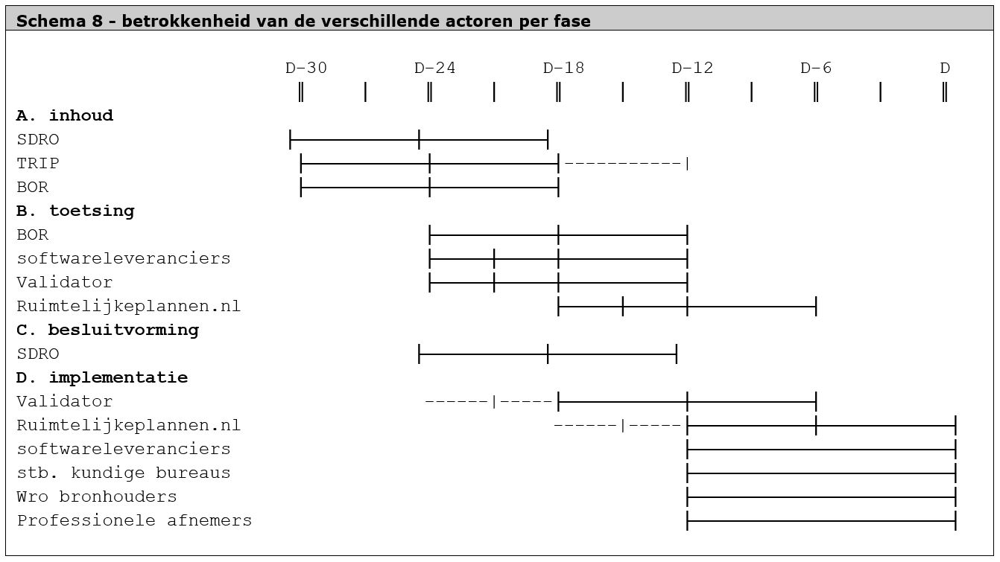
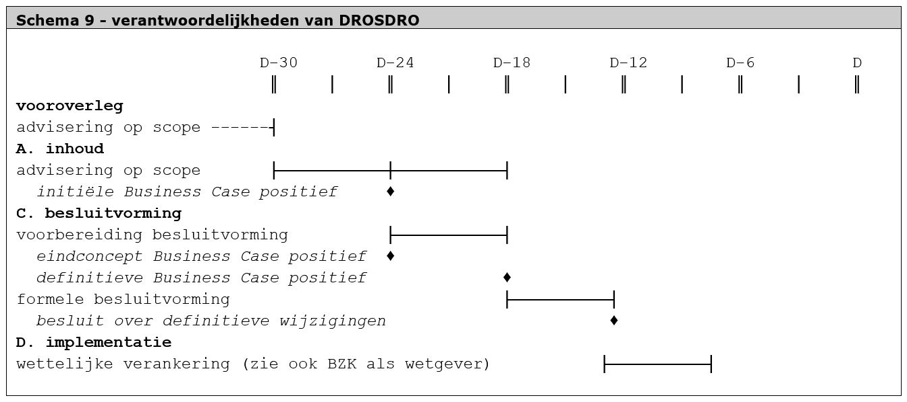
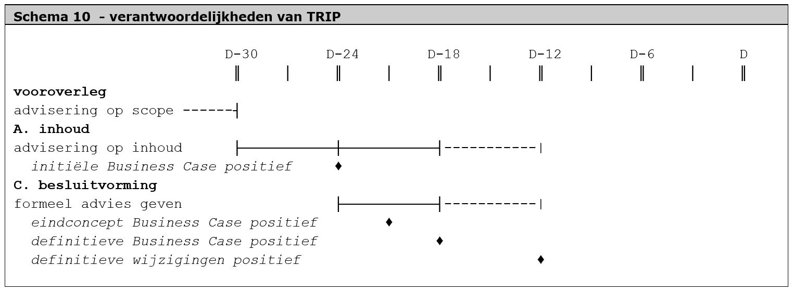
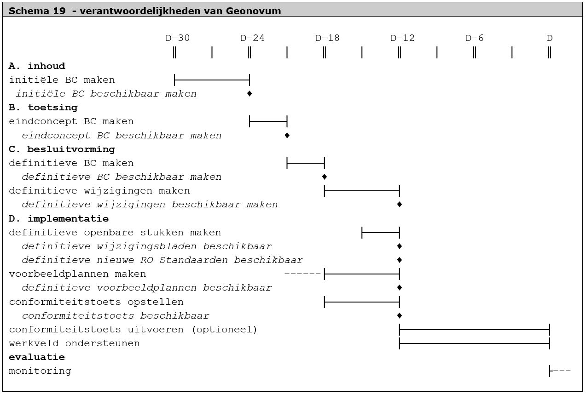

# Actoren

**In dit hoofdstuk worden de verschillende actoren in de RO keten beschreven die
bij het wijzigingsproces betrokken zijn. Voor iedere actor wordt een
omschrijving gegeven, en vervolgens worden de eigen noodzakelijke taken en
verantwoordelijkheden aangegeven binnen het algemene wijzigingsproces.**

Niet alle actoren zijn gedurende het hele proces betrokken bij het
wijzigingsproces. In Schema 8 wordt een overzicht gegeven van de betrokkenheid
van de actoren per fase. Verderop in dit hoofdstuk wordt dit per actor nader
uitgewerkt.

Hier onder volgt per actor een beschrijving van de belangrijkste
verantwoordelijkheden en mijlpalen.

## Stuurgroep Digitale Ruimtelijke Ordening (SDRO)

De stuurgroep Digitale Ruimtelijke Ordening(SDRO fungeert als het opdrachtgever-
/ opdrachtnemeroverleg voor het beheer van de RO-Standaarden en
Ruimtelijkeplannen.nl. De Stuurgroep DRO verzorgt de opdrachtsturing naar
Kadaster (voor Ruimtelijkeplannen.nl) en Geonovum (voor zowel
Ruimtelijkeplannen.nl als RO Standaarden) en komt minstens 2x per jaar bij
elkaar.

De Stuurgroep DRO heeft geen (sturings)relatie met de overige overlegverbanden
en ze is niet gericht op de behandeling van alle inhoudelijke zaken over het
beheer en de ontwikkeling van de RO Standaarden. Over kleine adaptieve
wijzigingen beslist Geonovum.

De Stuurgroep DRO is het besluitvormend orgaan met betrekking tot de kaders voor
de verschillende beheeropdrachten aan Kadaster en Geonovum (budget, tijd,
prioriteitstelling, planning&control, kwaliteit, bereik) én met betrekking tot
de inhoud. Over die inhoud laat de Stuurgroep DRO zich adviseren door Kadaster
en Geonovum en door het TRIP overleg. BZK kan zelf ook vanuit wetgevingsoogpunt
een adviserende rol vervullen. De Stuurgroep DRO fungeert ook als stuurgroep bij
majeure projectmatige vernieuwingen.

Voorgenomen wijzigingen moeten passen binnen de visie en binnen de daar uit
voortkomende ontwikkelplannen over meerdere jaren én resp. binnen de concrete
jaarplannen – zo niet moet dit tot bewuste wijziging en herprioritering leiden.
Ze moeten ook een plek krijgen op de lijst van vernieuwingsprojecten.

## Tripartite overleg (TRIP)

De RO Standaarden zijn met, voor en door het werkveld tot stand komen en worden
ook samen in stand gehouden. De rol van het TRIP is om dringend, maar geen
dwingend advies aan de Minister van BZK over voorgestelde wijzigingen. Het TRIP
wordt daarbij gevoed door de opdrachtnemer, Kadaster, Geonovum en door hun eigen
achterban (vanuit de ministeriële RO praktijk, de provincies en de gemeenten).
Mogelijke escalatie tijdens de besluitvormingsfase vindt plaats via het overleg
van de stuurgroep. Met name ook in de periode van vooroverleg is de rol van het
TRIP van belang, omdat hiermee de basis wordt gelegd voor het draagvlak tijdens
de besluitvormingsfase.

## Beheeroverleg Ruimtelijkeplannen.nl (BOR)

Ruimtelijkeplannen.nl is gezamenlijk in beheer bij Geonovum en het Kadaster. Het
beheeroverleg vindt gemiddeld negen keer per jaar plaats. Het beheeroverleg
wordt gevormd door specialisten van zowel Geonovum en Kadaster voor het beheer
van Ruimtelijkeplannen.nl. In het overleg worden alle voorkomende zaken
besproken die te maken hebben met het functioneren van Ruimtelijkeplannen.nl.

## Softwareleveranciers

Hier wordt met name bedoeld: de leveranciers van standaard software producten
waarmee Wro instrumenten gemaakt en gepubliceerd kunnen worden. Het onderstaande
schema is dan ook van toepassing op deze groep van softwareleveranciers.

Er zijn ook leveranciers van maatwerk software ten behoeve van specifieke RO
taken, zoals de software die nodig is voor het ondersteunen van de BZK
inspectie. De verantwoordelijkheden die dit met zich meebrengt zijn in dit
protocol niet opgenomen, behalve in het geval van Ruimtelijkeplannen.nl en de
Validator (zie volgende paragrafen), vanwege de bijzondere relatie en
afhankelijkheden met andere actoren in het wijzigingsproces.

In dit schema is de betrokkenheid geschetst bij het toetsen van nieuwe
ontwikkelingen in de periode D-24 tot D-12. Verder is het duidelijk dat de
inspanningen met name tijdens de implementatiefase plaatsvinden. Er is
aangegeven dat er wellicht eerder kan worden begonnen met het aanpassen van de
software dan het moment waarop de formele besluitvorming (D-12) wordt afgerond.
Dit is een verantwoordelijkheid van de individuele leveranciers, die een
zelfstandige afweging maakt wanneer een wijzigingsvoorstel voldoende zeker is.
De meeste leveranciers hebben er vertrouwen in zodra de Adviesgroep DRO een
positief dringend advies heeft gegeven.

Ook het uitleveren van de nieuwe software kent geen harde startdatum. Op enig
moment is een leverancier klaar met de aanpassingen en kunnen de updates worden
uitgerold bij de klanten. In bovenstaand schema is er een startpunt gegeven op
D-12. Dit heeft als reden dat op dat moment de Validator klaar is om de nieuwe
standaarden te toetsen, waardoor het voor de leveranciers op dit moment ook pas
mogelijk is om de eigen software extern te toetsen.

## Stedenbouwkundige bureaus

Stedenbouwkundige bureaus werken dienstverlenend naar Wro bronhouders. Zij zijn
betrokken bij het vervaardigen van plannen, zowel inhoudelijk als ook technisch.
De verantwoordelijkheden van stedenbouwkundige bureaus zijn vergelijkbaar met
die van de Wro bronhouders zelf (zie aldaar).

## Validator

De Validator is een technische voorziening die toetst of ruimtelijke plannen aan
de RO Standaarden voldoen. Hiermee heeft de Validator de rol van de neutrale
scheidsrechter binnen de RO. Hoewel de technische voorziening momenteel is in
beheer is bij het Kadaster, zijn de validatieregels in beheer van Geonovum . De
Validator heeft een zelfstandige functie die breder is dan de poortwachter rol
voor plannen richting Ruimtelijkeplannen.nl. De Validator toetst op een
welbepaalde set validatieregels. Het beheer van deze validatieregels is
ondergebracht binnen de beheerstructuur van de RO Standaarden zelf, om daar een
optimale afstemming in te krijgen. Geonovum stelt de validatieregels op. Het
Kadaster ontwerpt en beheert de Validator. Samen zorgen zij ervoor dat (een
testversie van) de Validator op tijd te gebruiken is in het proces.

In bovenstaand schema is de bijzondere verantwoordelijkheid van de Validator te
zien. Er wordt al in een vroeg stadium begonnen met het aanpassen van de
Validator, mogelijk meteen al op het moment dat de inhoudelijke fase is
afgerond. Dit komt omdat de softwareleveranciers op een later tijdstip
afhankelijk zullen worden van de Validator om hun eigen, aan de wijzigingen
aangepaste producten te kunnen toetsen. Ook de relatie met de
conformiteitstoets, die gebruik maakt van de diensten van de Validator, ligt ten
grondslag aan deze vooruitlopende activiteiten.

## Ruimtelijkeplannen.nl

Ruimtelijkeplannen.nl is de landelijke voorziening die verantwoordelijk is voor
het toegankelijk en raadpleegbaar maken van alle door de bronhouders beschikbaar
gestelde ruimtelijke plannen. De verantwoordelijkheden zijn opgesplitst in
enerzijds de website, en anderzijds de webservices. Deze webservices moeten
eerder klaar zijn dan de website, omdat afnemers hier mogelijk van afhankelijk
van zijn bij de implementatie van de wijzigingen in hun eigen processen en
software. Ook Ruimtelijkeplannen.nl werkt vooruit op de definitieve
besluitvorming[^1].

[^1]: Ruimtelijkeplannen.nl en Validator kennen ook een wijzigingsprotocol zoals
deze voor de RO Standaarden. Het wijzigingsprotocol van Ruimtelijkeplannen.nl is
te vinden via de
<https://www.ruimtelijkeplannen.nl/web-roo/docs/bronhouders/Wijzigingsprotocol_RO-Online_v1.0.pdf>

In bovenstaand schema is bovendien te zien dat er vanuit gegaan wordt dat
Ruimtelijkeplannen.nl 6 maanden voor de inwerkingtreding van de wijzigingen
helemaal klaar is om deze nieuwe bestanden te kunnen ontvangen. Deze marge is
ingebouwd om ketentesten te kunnen uitvoeren tijdens de implementatie bij andere
belanghebbenden.

## Professionele afnemers

De term professionele afnemer is gekozen om een onderscheid te maken met burgers
die ruimtelijke plannen willen inzien. De doelgroep burgers wordt niet gezien
als een actor in het wijzigingsproces, ondanks dat zij wellicht de belangrijkste
doelgroep zijn voor het raadplegen van de ruimtelijke plannen. Maar de
professionele afnemers worden wel gezien als actor, omdat de wijzigingen een
impact hebben of kunnen hebben op hun werkwijze.

## BZK als wetgever

BZK is bronhouder van ruimtelijk instrumentarium. Maar BZK is ook de
wetgever/beleidsmaker op het terrein van de ruimtelijke ordening en de Wro. Dit
brengt bepaalde extra verantwoordelijkheden met zich mee binnen het
wijzigingsproces. Dit zit met name in het feit dat er door de minister van BZK
formeel wordt besloten over wijzigingen, omdat de minister van BZK de
standaarden heeft verankerd bij ministeriële regeling. Ook het wettelijk
doorvoeren van de wijzigingen, eventueel met inbegrip van de EU
notificatieprocedure, wordt dus uitgevoerd door BZK als onderdeel van het
wijzigingsproces.

N.B. Behalve wetgever is BZK ook bronhouder van ruimtelijke instrumentarium, zie
volgende paragraaf.

## Wro bronhouders

De Wro bronhouders zijn alle partijen die ruimtelijke plannen, visies,
verordeningen, besluiten en AMvB's maken. Kortom, alle gemeentes, alle
provincies en het Rijk.

In onderstaand schema is te zien dat bronhouders alleen bij de implementatiefase
betrokken zijn. Dit doet de bronhouders geen recht. Echter, hun betrokkenheid
bij inhoudelijke afwegingen, toetsing en besluitvorming loopt gecoördineerd via
de softwareleveranciers en het TRIP, waar met name de bronhouders een
belangrijke rol spelen.

## Geonovum als beheerder van de RO Standaarden

Geonovum is de beheerder van de RO Standaarden en in die hoedanigheid nauw
betrokken bij het gehele wijzigingsproces. Geonovum faciliteert alle
bovenstaande processen. In onderstaande schema zijn alleen de eigen activiteiten
weergegeven, de faciliterende activiteiten niet. Ook voor het gemak zijn
producten maar één keer weergegeven in één fase hoewel ze bij verschillende
fasen kunnen behoren (de voortgang van Business Case van initiëel, naar
eindconcept naar definitieve is onlosmakbaar van respectievelijk de eerste,
tweede en derde versies van de wijzigingsvoorstellen; daarnaast hoort
inhoudelijke toetsing zowel onder Inhoud als Toetsing, etc).

Uit onderstaand schema blijkt vooral de voortdurende betrokkenheid van Geonovum
als trekker van het beheerproces. De niet weergegeven faciliterende rol is
geformaliseerd in de inrichting van het beheer. Geonovum is voorzitter van BROS
en organiseert regelmatig overleg met andere betrokken zoals de
softwareleveranciers[^2]. Verder wordt er in Hoofdstuk 8 nader ingegaan op de
integrale aspecten van communicatie. Ook op die plek wordt aan de rol van
Geonovum meer invulling gegeven.

[^2]: Meer algemene informatie over het beheer van de RO Standaarden is te
vinden op de website van Geonovum
<http://www.geonovum.nl/onderwerpen/ruimtelijke-ordening-standaarden/algemeen-ro-standaarden>

